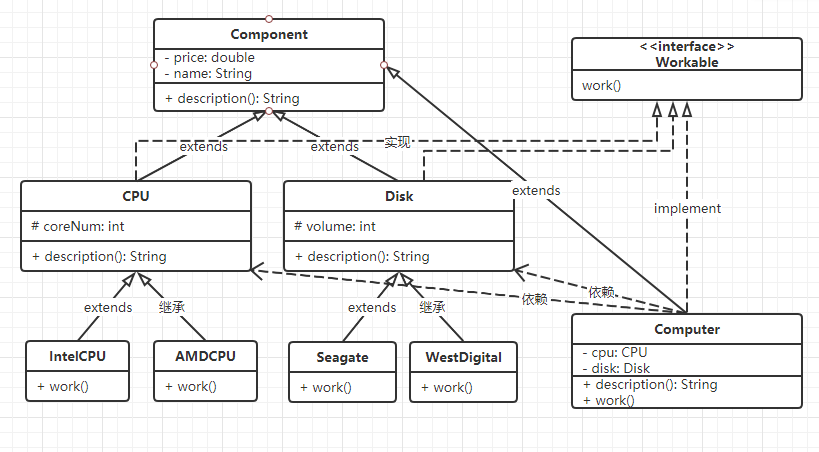

# 一个简单的 "电脑商店" Java源码

1. PC 的配置有各种组合, 相互组合为完整的电脑
>  * CPU: Intel, AMD
>  * 硬盘: 希捷, 西部数据 等
>  * 显卡: 英伟达, AMD 等
>  * 主板电源内存等

2. 这个程序比较简单, 只涉及了CPU和硬盘

>  * 可以查看到商品的价格和配置信息
>  * 该型电脑是哪些部件再工作

3. 主要用来学习了解java的接口, 抽象类以及类的继承关系

   

   #### 如何设计:

   * 提取公共特征:

     * 从intel和AMD两款CPU中提取出抽象类CPU (同理硬盘提取出抽象类Disk)
     * 比如CPU `[ Intel i5 / 6核 / 1599元 ]`  `[ AMD r7 / 8核 / 2599元 ]`
       * CPU公共特征有 `名字name / 核心数coreNum / 价格price`
       * 同样Disk公共特征有 `名字name / 容量volume / 价格price`
     * 再提取CPU和Disk的公共特征: `名字name / 价格price`
       * 提取出抽象类Component
       * 再比如Computer也有 名字和总价, 也可以继承Component
     * 这些部件和整机都可以工作但是工作方法不一样, 而这些工作方法把它定义为一个叫Workable的接口
     * Computer由CPU和Disk等组成, 他们是一种依赖关系

   * 这种设计过程是从具体到抽象, 通过提取共同特征, 把这些抽象的东西设定为抽象类

     

4. 看看整个系统的全局UML类图, 对该程序有个清晰的认识:




5. 对照UML类图查看源代码及其注释理解工作方式


* 目录结构

```
  ComputerStore
  |
  ├─ concept
  |  ├─ Component.java	//所有类的父类
  |  └─ Workable.java	//接口
  |  
  ├─ product
  |  ├─ Computer.java	
  |  └─ ComputerStore.java	//整个系统的主类
  |
  ├─ types
  |  ├─ parts	//各个部件
  |  |  ├─ AMDCPU.java
  |  |  ├─ IntelCPU.java
  |  |  ├─ Seagate,java
  |  |  └─ WestDigital.java
  |  |
  |  ├─ CPU.java
  |  └─ Disk.java
```
